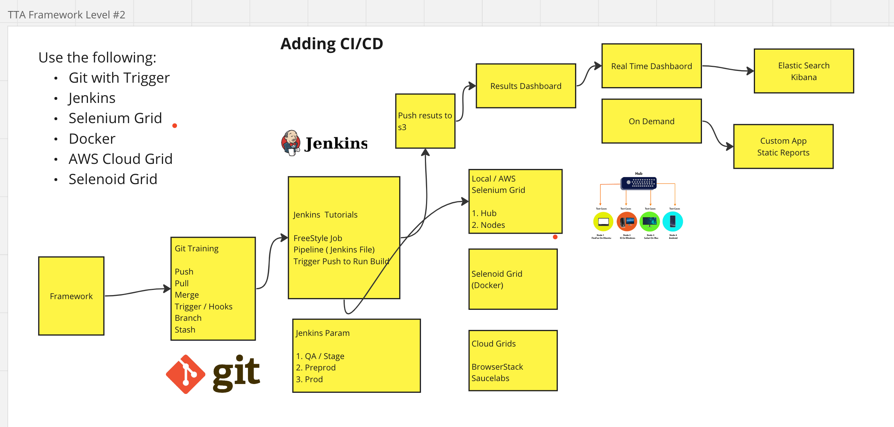

#Selenium Automation Framework

#Author: Pooja KM

* Java, Selenium, TestNG
* Maven, AssertJ, POM
* Thread Local Support → Thread Safety
* Allure Report
* Excel Sheet for Test Data → Data Provider
* Read the username and password from Properties-
* TestNG, @Test, Before and After Method.
* Cloud Grids
* SonarLint, Java > 8
* Run Local and on Selenoid Integration

mvn test -Dsurefire.suiteXmlFiles=testng.xml

